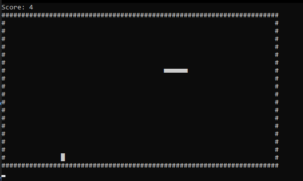

# Console Snake Bites 🐍

A classic arcade Snake game built natively for the command line using C# and .NET Core. Guide the snake to collect apples, grow your tail, and achieve the highest score possible without hitting the arena walls or tangling into yourself!

## Gameplay



## Features

- **Custom Grid Arena:** Renders a clean 70x20 ASCII boundary (`#`) dynamically calculated using custom coordinate objects.
- **Responsive Input Handling:** Utilizes non-blocking keyboard polling (`Console.KeyAvailable`) inside a custom frame timer to allow instant directional snapping without interrupting the game loop.
- **Dynamic Tail Growth:** Tracks previous body positions using a generic `List<Coord>` history queue that scales dynamically as apples are consumed.
- **Instant Collision Detection:** Continuously evaluates vectors against bounding walls and coordinate history, instantly resetting the arena and score upon impact.
- **Score Tracking:** Live score updates rendered directly above the arena.

## Controls

Use your keyboard's **Arrow Keys** to steer the snake:

- **`↑` Up Arrow:** Move Up
- **`↓` Down Arrow:** Move Down
- **`←` Left Arrow:** Move Left
- **`→` Right Arrow:** Move Right

## Visual Legend

- `■` **Snake Head & Body**
- `█` **Apple (Target)**
- `#` **Arena Wall (Hazard)**

## Getting Started

### Prerequisites

- [.NET SDK](https://dotnet.microsoft.com/download) installed on your system.

### Running the Game

1. Clone the repository:
   ```bash
   git clone [https://github.com/Alyasa62/Console-Snake-game-in-C-Sharp-.git](https://github.com/Alyasa62/Console-Snake-game-in-C-Sharp-.git)
   ```
